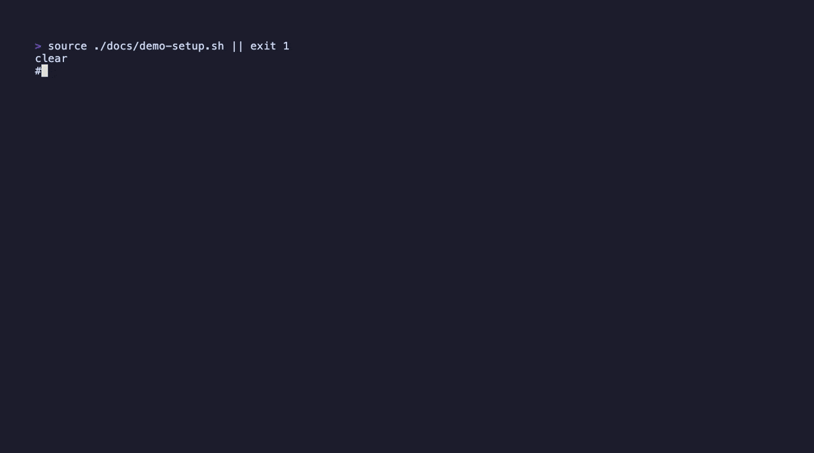

# LeetMate

> 不给答案，只给提示——然后在你忘记之前，把题排进复习。

LeetMate 是一个跑在终端里的 **LeetCode 刷题辅导工具**，围绕「面试备战」设计。它不替你解题——你卡住时给一个**提示**而不是答案；练过的题会被排进**间隔复习队列**，赶在你忘掉之前回来。

<!-- TODO: demo gif (M4) -->
<!-- <p align="center"></p> -->

## 为什么造它

市面上的 LeetCode 工具要么只给题、要么直接给答案，都不利于真正学会。LeetMate 介于两者之间：卡住时按 `1`（Hint）只拿到算法方向、按 `2`（Nudge）拿到卡点提示、按 `3`（Review）让它挑你代码的 bug——**前三级绝不输出完整代码**；只有按 `4`（Answer）并二次确认才给完整解法。每一道练过的题自动进 FSRS 复习队列（开发中）。

## 功能

- 🧠 **苏格拉底式辅导** — Hint / Nudge / Review / Answer 四级，防代答 system prompt 守住前三级不泄答案
- 📋 **题单** — 内置「热题 100」「面试经典 150」，进度跟踪 + 自动跳到下一题；支持自定义题单
- 🧩 **基于 [leetgo](https://github.com/j178/leetgo)** — 代码骨架、本地测试、提交全交给 leetgo
- 🔁 **间隔复习** — FSRS 调度（开发中，M3）
- 🎛️ **自带模型** — 一行 `preset` 切换 Gemini / 硅基流动 / Groq / DeepSeek，只填 key 即可
- 🗳️ **本地优先** — 所有练习记录、对话、进度都在本地 SQLite，数据不离机
- 🌐 **中英文界面** — config 一行切换
- 📜 **流式输出 + 可展开详情** — 辅导打字机式流式；默认折叠预览，`o` 展开全文 / 完整错误

## 状态

🧪 **Alpha**。辅导 + 题单闭环已可用，FSRS 复习队列开发中。

| 模块 | 状态 |
|------|------|
| leetgo 集成（pick/test/submit）| ✅ |
| LLM 辅导（四级 + 防代答 + 流式） | ✅ |
| 题单 + 进度 | ✅ |
| preset 多模型 | ✅ |
| FSRS 间隔复习 | 🚧 进行中 |
| `leetmate init` 配置向导 | 📋 计划 |

## 前置依赖

- Go 1.26+
- [leetgo](https://github.com/j178/leetgo)：`brew install leetgo` 或 `go install github.com/j178/leetgo@latest`，并 `leetgo init` 配好 LeetCode 认证
- 一个 LLM API key（Gemini / 硅基流动 / Groq / DeepSeek 任一，均有免费额度）

## 安装

```bash
git clone https://github.com/DuckInAShirt/leetmate.git
cd leetmate
go build -o leetmate ./cmd/leetmate
```

## 配置

`~/.config/leetmate/config.yaml`：

```yaml
language: zh          # 或 en

leetgo:
  workspace: /path/to/your/leetgo/workspace

# 选一个 preset，对应平台的 key 放进 .env 即可
llm:
  preset: siliconflow  # gemini | siliconflow | groq | deepseek
```

`~/.config/leetmate/.env`（只放 key）：

```dotenv
SILICONFLOW_API_KEY=sk-...   # 或 GEMINI_API_KEY / GROQ_API_KEY / DEEPSEEK_API_KEY
```

可选 preset：

| preset | 平台 | 默认模型 | 备注 |
|--------|------|---------|------|
| `gemini`（默认） | Google | gemini-2.0-flash | 全球，免费 tier |
| `siliconflow` | 硅基流动 | GLM-4-9B（可改 DeepSeek-V3 等） | 国内访问稳，需实名 |
| `groq` | Groq | llama-3.3-70b | 免费、极快，海外网络 |
| `deepseek` | DeepSeek 官方 | deepseek-chat | 极便宜，指令遵循强 |

## 用法

```bash
./leetmate
```

进 TUI 后：
- **今日题目 / 题单** — 选题开始
- `e` 编辑代码 · `t` 本地测试 · `s` 提交
- `1` Hint · `2` Nudge · `3` Review · `4` Answer（二次确认）
- `Tab` 切代码/辅导区 · `o` 展开详情 · `↑/↓` 滚动

## 自定义题单

`~/.config/leetmate/studyplans/my-plan.yaml`：

```yaml
id: my-plan
title: 我的薄弱题
items: ["5", "53", "200"]   # leetcode 题号
```

## 技术栈

Go · [bubbletea](https://github.com/charmbracelet/bubbletea) · [leetgo](https://github.com/j178/leetgo) · SQLite (modernc) · FSRS

## License

MIT
